  

  

  
  
  

## Engenharia de software para sistemas que precisam funcionar de verdade

Sou engenheiro de software backend com cerca de cinco anos de experiência em empresas, principalmente com **Java e Spring**. Já trabalhei com sistemas financeiros, APIs REST, mensageria, integrações entre domínios, aplicações legadas e operação em produção.

Gosto de transformar problemas complexos em fluxos compreensíveis, testáveis e seguros para evoluir — sem adicionar arquitetura onde clareza resolve melhor.

<table>
  <tr>
    <td width="33%" valign="top">
      01 / ESPECIALIDADE  
      <strong>Backend e integrações</strong> 
      APIs, mensageria e contratos claros entre domínios.
    </td>
    <td width="33%" valign="top">
      02 / CONTEXTO  
      <strong>Sistemas críticos</strong> 
      Financeiro, legado, alta volumetria e produção.
    </td>
    <td width="33%" valign="top">
      03 / BASE  
      <strong>Campinas, SP</strong> 
      Disponível para colaboração remota.
    </td>
  </tr>
</table>

## Onde gero valor

| 01 — Integrações confiáveis | 02 — Evolução com segurança | 03 — Qualidade operacional |
| :--- | :--- | :--- |
| APIs e fluxos assíncronos com Kafka, RabbitMQ e SQS. | Migração gradual, reconciliação de dados, testes e feature toggles. | Diagnóstico em produção, revisão de código, CI/CD e observabilidade. |

Um exemplo: em um fluxo financeiro integrado a cinco domínios, ajudei a decompor a migração para o trabalho paralelo de seis pessoas e estruturei a reconciliação entre o sistema novo e a referência existente, comparando IDs, quantidades e valores antes da troca definitiva.

## Ferramentas que uso para entregar

  

- **Backend:** Java 8/11, Spring Boot, Spring Data/JPA, APIs REST e microsserviços
- **Dados e integração:** PostgreSQL, Oracle, Redis, Kafka, RabbitMQ e AWS SQS
- **Cloud e entrega:** AWS, Docker, Kubernetes, Git e CI/CD
- **Qualidade:** JUnit, Mockito, SonarQube, code review e troubleshooting
- **Também trabalho com:** Python, Go, Rust, Node.js, FastAPI e Angular

## Como penso engenharia

- O domínio vem antes do framework.
- Simplicidade é uma decisão técnica, não falta de ambição.
- Mudanças críticas pedem validação observável e caminho de retorno.
- Código sustentável deixa contexto para a próxima pessoa.

Mais sobre minha trajetória e minhas decisões de engenharia em [Sobre mim](./ABOUT.md).

---

  <strong>Vamos conversar sobre backend, integrações ou evolução de sistemas?</strong>  
  

